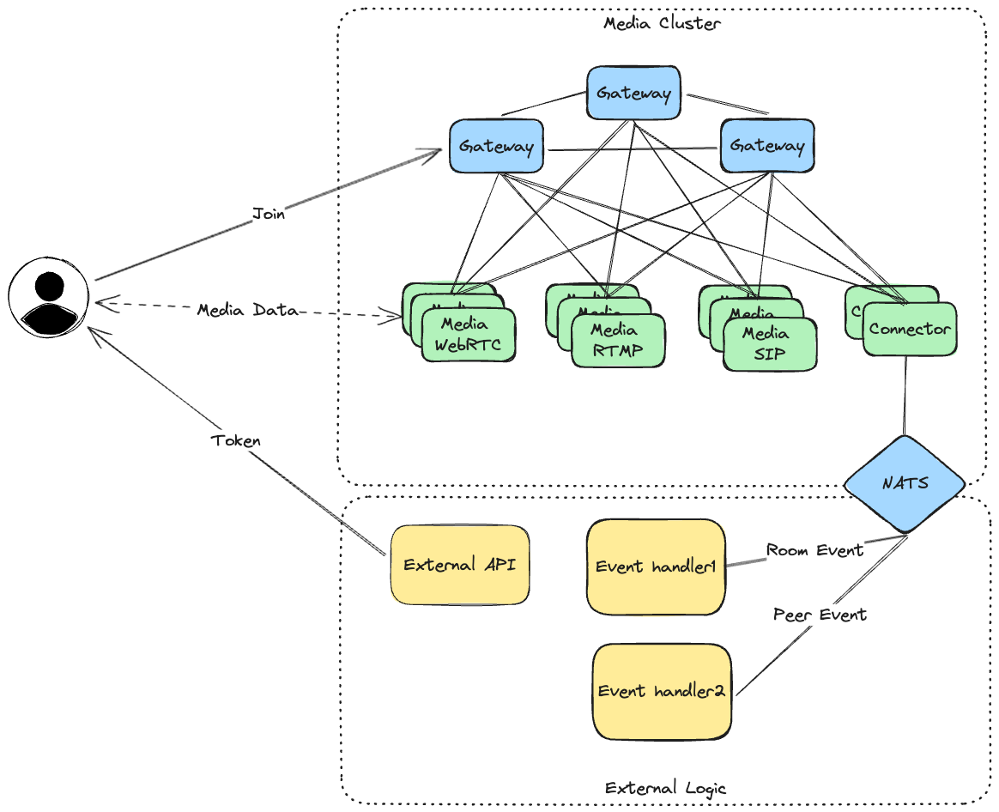

- Feature Name: media-global-cluster
- Start Date: 2024-02-02
- RFC PR: [8xff/rfcs#0003](https://github.com/8xff/rfcs/pull/0003)

# Summary
[summary]: #summary

This RFC proposes way to orchestrate cluster topology and how we select the best node for each request.

# Motivation
[motivation]: #motivation

In live stream application, the most important thing is the quality of the stream. We need to ensure that the stream is delivered to the client with the best quality. To do that, we need to select the best node to serve each request. The best node is the node which is closest to the client and have the best network connection to the source.

# User Benefit

The user can setup a cluster across multiple regions and the system will automatically select the best node to serve each request. Mostly steps is automated and the user only need to setup the cluster and the system will do the rest.

# Design Proposal

## Abstract Design

### Gateway

We propose a gateway node, which will take care to route each request to best node. The process is described as below:

Update info process:

- Each node will broadcast its information to all gateway nodes in same zone.
- Each gateway node will broadcast its information to all gateways.

Routing process:

- If received gateway node is closest to the client, it will chose the best node to serve the request and send back the information to client.
- If received gateway node is not closest to the client, it will forward the request to the closest gateway node.

### Topology

Each media servers is connected to all gateway nodes in same zone. Each gateway node is connected to all gateway nodes in same zone and all gateway nodes in other zones.

By that way, data exchange between node inside a zone with take care by gateway nodes in that zone, this ensure both data cost and latency.

Data exchange between node in different zone will be send from media server to gateway node in source zone, then to gateway node in destination zone, then to media server in destination zone. With the help of atm0s-sdn, we can ensure that the data will be send through the best network path. Note that the data can be relayed by other gateway nodes.

## Implementation Details

### Gateway

Each media-server will broadcast it's information to all gateway nodes in same zone over a pubsub channel `gateway-zone-{zone-id}`. The information will include:

- Live count
- Max count
- Node usage
- Transport protocol

Each gateway node will broadcast it's information to all gateway nodes over a pubsub `gateway-global`. The information will include:

- Zone id
- Lat, Long
- Summary of all media servers grouped by transport protocol (live count, max count, nodes usage)

For detect location of clients, each gateway node will have a geo-location database, (for example: [GeoLite2](https://dev.maxmind.com/geoip/geoip2/geolite2/)). Each time a client connect to gateway node, the gateway node will detect the location of client and finding closest gateway node to client. If the closest gateway node has same location for itself, it will chose the best node to serve the request and send back the information to client. If the closest gateway node is not itself, it will forward the request to the closest gateway node.

### Topology

We use atm0s-sdn manual discovery service to build topology, it is done by config local tags and connect tags. The config is described as below:

| Server        | Local Tags                     | Connect Tags |
| ------------- | ------------------------------ | ------------ |
| Gateway       | gateway, gateway-{zone-id}     | gateway      |
| Media Server  | media-{protocol}-{zone-id}     | gateway-{zone-id} |

## Potential Impact and Risks

This topology is relized on node configured zone-id, it that value is wrong, the cluster will not work correctly.
Other risks is accuracy of geo-location database, if the database is not accurate, the gateway node will not chose the best node to serve the request.

# Rationale and alternatives
[rationale-and-alternatives]: #rationale-and-alternatives

Whe have 2 alternatives but we think that the proposed design is the best in the space of possible designs.

- Single zone: We can use a single zone and use a single gateway node to serve all requests. This is the simplest way but it will not work well in case of large scale.
- Manual multi zones: We can use a multi zones and manually configure the best node for each request. This is the most flexible way but it will take a lot of time to configure and maintain.

# Unresolved questions
[unresolved-questions]: #unresolved-questions

None at this time.

# Future possibilities
[future-possibilities]: #future-possibilities

We have some possibilities to improve the system:

- Node selection logic can be improved by using machine learning to predict the best node for each request.
- Node selection can based on more metrics: CPU, RAM, Disk, Network, ...